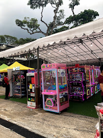
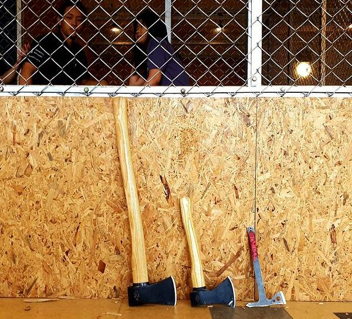

It was so nerve-racking for me to plan that date, and while it was nothing as
compared to your well thought out date ideas and plans, I hope you liked it. Pro
tip: It is never a good idea to go for axe throwing on your first date. You
can't really converse with the potential love of your life (who is now the love
of my life), and in all honesty it wasn't really that fun. Next time maybe you
can consider the zoo as she hinted 🙈 (well there is not gonna be a next time
for any of us anyways eh) I was a lucky guy to chance upon the Thai style pasar
malam thingy, and probably made one of the best decisions in my life when I
decided to put aside my bias for claw machines and put that note into the
machine. It never dawned on me till much later that the experience mattered so
to you and I am glad that you found me as someone you could trust. Dinner was
fine, it was nothing to write home about as compared to all the other places
you've brought me to. The subsequent dessert bar was mind blowing though, and I
am glad that you enjoyed the experience. I did very much enjoy our date. It was
when we were playing the claw machine and you grabbing me by the arms that I
started falling in love with you. While I may have looked sheepish when you did
that, I definitely appreciated your receptiveness to me. It was inappropriate
for me say say "I love you" then, but now that we are on the same page, I would
like to do exactly that. I love you my dear Audrey! (Low key regretting that I
did not take any photos to upload here. So you are just stuck with this GIF
[pronounced "gift"] of my silly smile hehe)

