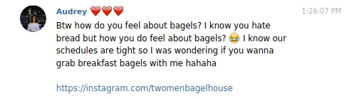

It was really touching that you initiated the second date. I bet you felt my
insecurity before I ordered and I loved it when you came over to guide me. I was
still unsure when I ordered though! But what resulted was amazing and thank you
for opening my taste buds and horizons :) Even though Starbucks wasn't really
comfortable for my large ass laptop, and the lack of a second monitor made my
planned work un-doable, the view I had made everything worth it. The emotions I
feel when I look up and see the face of someone I have such strong feelings for
is irreplaceable. During lunch, my eye was opened once again with some real
truffle! And it was really funny to see you forget to take a picture opps 🙈 I
really loved our subsequent study session at the Esplanade and while I had to
participate in a group meeting, you were very sweet and accompanied me
downstairs so you could be with me. Sorry that you you got rashes from the seats
:'( Once again, dinner was planned by you and while the sides (and popcorn) was
meh, the main course was definitely the best beef I've eaten in my life. I can't
wait for more dates with you. And hopefully I can come up with some amazing
plans as you always do. I love you :)

