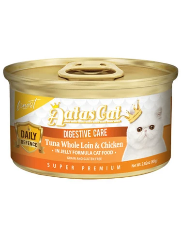
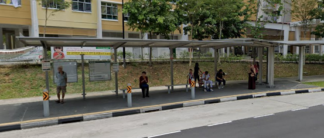

This was such a spontaneous date and hehe spontaneous Nelson loves it! Zooming
on the MRT was definitely something new and fun! This was the day I regretted
not locking my fingers with yours as I held your hand while we were walking in
Takashimaya. That memory of us makes me long for you so much more and I can't
wait for the day where I can hold your hand :) And once again, you planned for
the whole date and brought me to try so many awesome things! That was a truly
Japanese themed day, with the Udon, Matcha, then Unagi. The best part was the
walk home from Bukit Panjang, and I thoroughly enjoyed that late night talk +
the physical closeness we had to each other. I really long for that warmth again
and how I wish that that that night didn't end. I love you and I miss you :')

